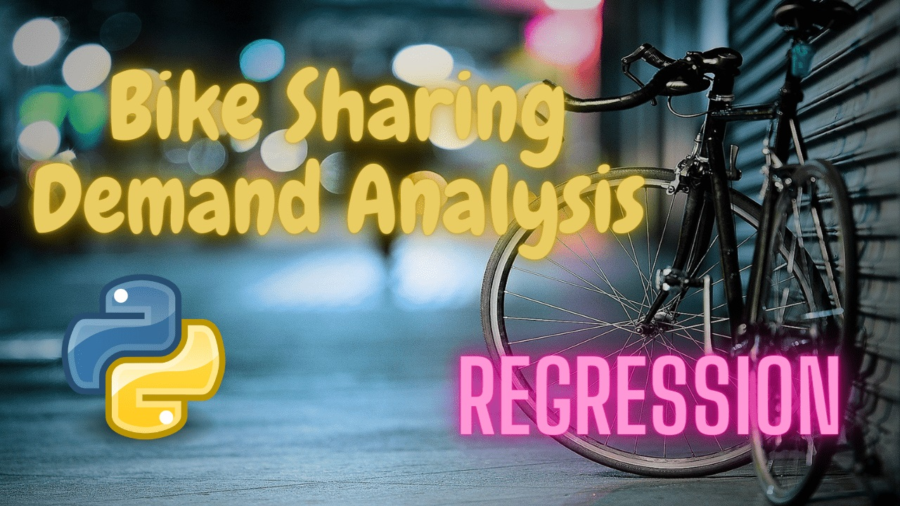

# Bike_Sharing_demand_Prediction_Sanskar
### Welcome to the Bike Sharing Demand Prediction repository! This project focuses on predicting bike rental demand using supervised machine learning techniques.

 The introduction of rental bikes in urban cities has aimed to enhance mobility comfort and offer the public an efficient means of transportation. Ensuring the availability of rental bikes at the right time is crucial to minimize waiting times for users and optimize their experience. However, providing a stable supply of rental bikes becomes a significant concern. To address this challenge, the key lies in accurately predicting the bike count required at each hour.

 Given the problem statement,I have been provided with two datasets, containing essential features such as Date, Rented Bike counts, hour, Temperature, Rainfall, Snowfall, Seasons, and more.So, First I have explore and analyse the data where I have done Data cleaning,remove duplicates and outliers then feature engineering to create relevant predictors for the predictive model.

 My primary objective is to develop a predictive model capable of forecasting the number of bikes needed for users in each hour. This model will leverage the historical data and incorporate various factors such as time of day, weather conditions, and seasonal variations to accurately predict bike demand patterns.

 The successful implementation of the predictive model will enable rental bike services to make bikes readily available and accessible to the public when they need them most. As a result, waiting times will be reduced, leading to enhanced mobility comfort for urban residents. Moreover, this predictive approach will encourage more individuals to adopt sustainable transportation options, contributing to a greener and more efficient urban environment.

